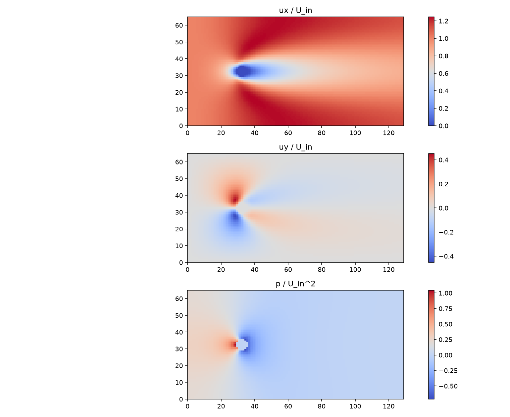
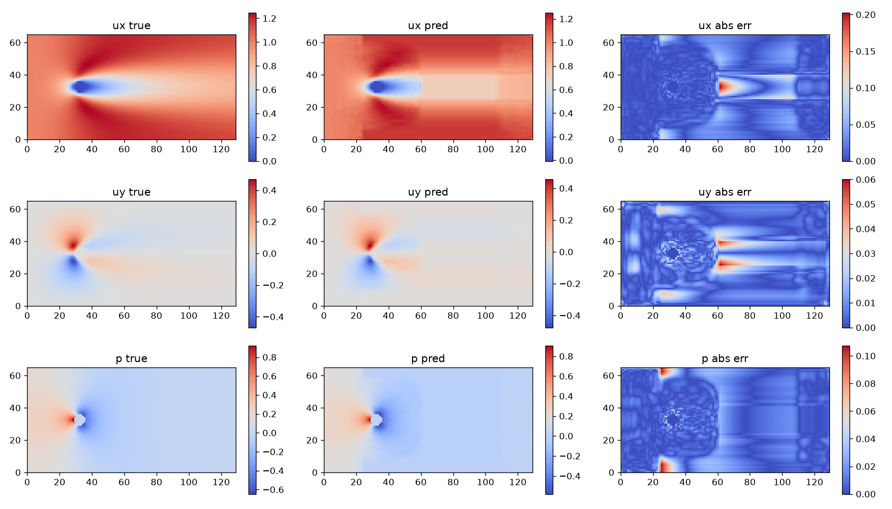

# 2D Navier-Stokes Surrogate Model (CNN)

A deep learning surrogate model that predicts steady 2D incompressible flow fields (velocity and pressure) around a cylinder directly from the inlet Reynolds number. This project replaces computationally expensive OpenFOAM CFD simulations with a PyTorch U-Net, delivering millisecond inference times for design-space exploration.


*OpenFOAM generated ground-truth data (Re=5): Velocity (ux, uy) and Pressure (p) fields normalized by inlet conditions.*

## 📊 Key Results
The model was trained on 80 Reynolds numbers and evaluated on 10 completely held-out test cases.
* **Velocity Relative L2 Error:** `4.05%`
* **Pressure Relative L2 Error:** `13.85%`


*True vs. Predicted vs. Absolute Error on an unseen test Reynolds number.*

## 🛠️ Pipeline Overview
1. **CFD Data Generation:** Automated parameter sweep of 100 steady, laminar cases using OpenFOAM (`simpleFoam`). Re range: 5 to 40. The same mesh is reused for all cases to ensure spatial alignment.
2. **Data Engineering:** Unstructured finite-volume cell data is exported to VTK and interpolated onto a fixed $129 \times 65$ Cartesian grid using PyVista. 
3. **Physics-Aware Processing:** Fields are normalized using dynamic pressure scaling ($u/U_{\infty}$, $p/U_{\infty}^2$). A binary mask excludes the solid cylinder from the loss calculation.
4. **Model Architecture:** A compact PyTorch U-Net takes the geometry mask and Reynolds number map as input, and outputs the 3-channel flow field.
5. **Training & Evaluation:** Trained with Masked Mean Squared Error (MSE). Evaluated using Relative L2 norm on strictly held-out Reynolds numbers (no data leakage).

## 🚀 How to Run
```bash
# 1. Generate OpenFOAM dataset (requires OpenFOAM installed)
./make_cases.sh
./run_all.sh

# 2. Convert to PyTorch tensors
python3 scripts/convert_all.py

# 3. Train the surrogate
cd src && python3 train.py

# 4. Evaluate on test set
python3 evaluate.py
